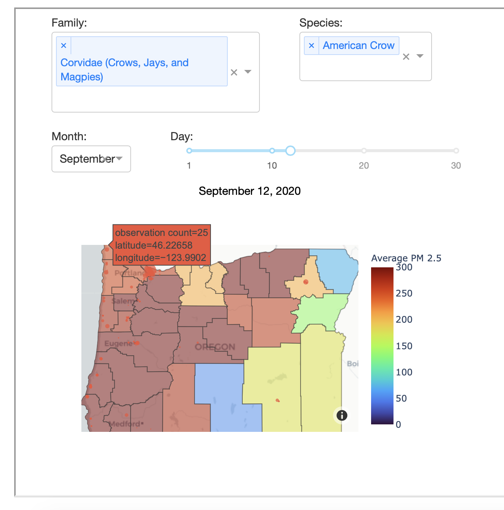
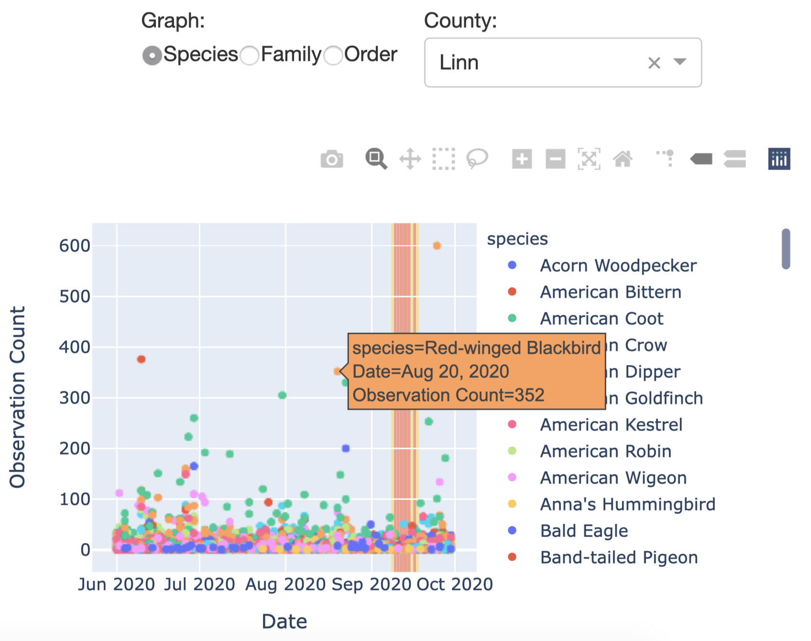
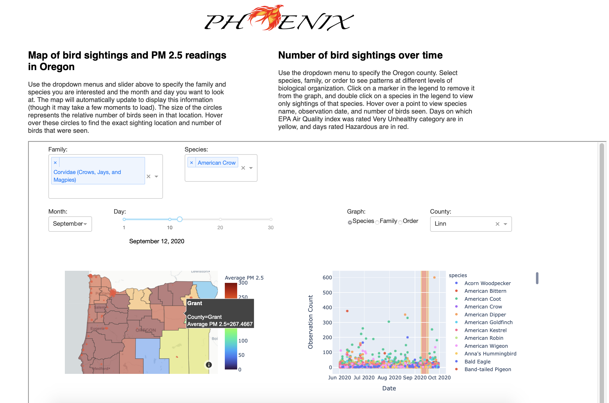

### Ocean's 4 Capstone CSE583 Project
# Phoenix
 

## An investigation into the impact of air quality on bird observation counts

Phoenix offers an introductory exploration of how air quality surrounding the 2020 Oregon wildfire events impacted bird observations in the state. 

As 2020 highlighted, larger wildfires and longer fire seasons are increasingly likely in the Western U.S. under climate change. While the direct effects of fire are apparent, the secondary effect of smoke on avian ecology is somewhat elusive. In general, birds tend to be very susceptible to air contamination and are highly mobile. Paired with a constantly shifting distribution of air particles, this makes for a spatially and temporally difficult interaction to study. Using detailed citizen scientist data from eBird and air quality data from the Oregon Department of Environmental Quality, Phoenix is a first step in examining this dynamic. 

Phoenix presents an initial analysis of bird sightings (segmented by species, family, class) against PM2.5 air quality levels for researchers and those familiar with statistical analyses. Additionally, Phoenix prioritizes scientific communication and community engagement: it includes a visualization mapping tool to be accessed by recreational birders. If made widely available as an interactive map on a website, birders will be able to use this information to gain a better understanding of how to adjust their practices and get the most out of their experience.

## Organization
This repository contains several different integrations that each require certain files and structures. Our app, for example, is hosted by Heroku and is required to be in the main with `requirements.txt` and `Procfile`. Additionally, the github website requires a 'doc' directory to format the website, which is distinct from our project documentation, labeled 'documentation'. The rest of our code and data can be found in 'phoenix', which retains a conventional format.

The project has the following structure:
<pre>Phoenix/
  |- README.md
  |- phoenix/
     |- data/
        |- Daily_Avg_PM2.5_Location.csv
        |- ORAQ_StationCounties.csv
        |- OR_DailyAQ_byCounty.csv
        |- Oregon_Resident_Species.md
        |- Oregon_counties_map.geojson
        |- PM2.5_metadata.txt
        |- category_labels.csv
        |- ebd_app_data.csv
        |- shortened_bird_data.csv
     |- demos/
        |- Dash_App_Demo.mp4
        |- Researcher_Demo.ipynb
     |- code/
        |- air_quality_knn.py
        |- app.py
        |- appfunctions.py
        |- data_cleaning.py
     |- tests/
        |- test_air_quality_knn.py
        |- test_app_functions.py
        |- test_data_cleaning.py
  |- documentation/
     |- ComponentSpecification.md
     |- FunctionalSpecification.md
     |- TechnologyReview.pdf
     |- Presentation.pdf
     |- appscreenshot1.png
     |- appscreenshot2.png
     |- appscreenshot3.png
     |- compspec.png
  |- docs/
     |- index.html
     |- logo.png
  |- .gitignore
  |- .travis.yml
  |- License.md
  |- Procfile
  |- app.py
  |- environment.yml
  |- requirements.txt
</pre>
## How to Use Phoenix
There are several ways you can use Phoenix, depending on your intent:

### Research
Researchers and the quantitatively-minded should look to our demo jupyter notebook called `Researcher_Demo.ipynb` in the directory `phoenix/demos`, where you can find a more detailed description of our analysis, as well as accompanying visualizations. Phoenix uses Altair for statistical visualizations, and its code can easily adapted for future research.

To view this file, you can simply open it on Github (or if Github is struggling to render it, copy and paste the file's url into Jupyter's online notebook viewer at: https://nbviewer.jupyter.org). However, to keep the file size down on Github, you will need to run the code in order to see the visualizations and output. To do this, you must first perform a local install as described below, then conda install `Jupyter Notebook` (https://jupyter.org/install).

### Recreational birding

For recreational birders and those interested in viewing a map of these data, we provide a dash app where you can explore resident species observations and air quaility index (AQI) at several geographic and taxonomic levels. 

Using the dropdowns and sliders, you can modify the map to view certain species observation points against air quality by county for a selected day. Hovering your mouse over the counties or data points gives you more detailed information:
 
 

 
 
To the right, you can view all of the observation data over the course of four months by county, overlayed on colored regions indicating poor air quality for those days. Here, you can choose the county to plot and the taxonomic level you wish to view. Additionally, you can select and deselect certain species/families/orders in the legend of the plot, further refining your view of the data. And again, hovering your mouse over the graph reveals even more information about each data point:
 
 

 
 
This app and its instructions can be viewed directly on our website, https://emilysellinger.github.io/Phoenix.github.io/. If you are experiencing performance issues with the online version (if the map won't load, for example), your next best option is to do a local installation of the repository, as described in the section below. This is what the website should look like:
 
 

 
 
 
## Local Installation
First, you will need an installation of `conda`. There are several ways to achieve this, which you can find at: https://docs.conda.io/projects/conda/en/latest/user-guide/install/

To install `Phoenix` you will need to first clone the repository onto your own computer using the following `git` command in the terminal at the directory you wish to install to:  
<pre>git clone https://github.com/emilysellinger/Phoenix.git</pre>

Next, you will need to have all of the software dependencies needed for `Phoenix` to run. The best way to do this is to use the virtual environment created for this project. You can create the `Phoenix` virtual environment on your computer by using the following command:
<pre>conda env create -f environment.yml</pre>

To begin using this environment, activate it with
<pre>conda activate project_CSE</pre>

Now you can use the terminal to run any of the code found in the Phoenix repository. For example, if you would like to run the Researcher Demo notebook (after installing Jupyter Notebooks), make the cloned repository your working directory and run:

<pre>jupyter notebook phoenix/demos/Researcher_Demo.ipynb</pre>

Alternatively, if you would like to run a local version of the dash app, run:

<pre>python app.py</pre>

And after it loads, copy and paste the server address (`http://127.0.0.1:8050/`) into a browser to view the app.
 
 
## Data Sources
### eBird Basic Dataset
- A comprehensive birding dataset that includes checklist and observation data submitted by citizen scientists and volunteers on the widely-used [eBird](https://ebird.org/home) app.
- This data is hosted and managed by the Cornell Lab of Ornithology and can be found at: https://ebird.org/science/download-ebird-data-products
- Citation: *eBird Basic Dataset. Version: EBD_relSept2020. Cornell Lab of Ornithology, Ithaca, NY. Oct 2020.*

### Oregon Department of Environmental Quality Station Reports
- Hourly air quality reports for monitoring stations across the state of Oregon. The PM2.5 data averaged over each day is the only air quality metric used for this project.
- This data is hosted and managed by the Oregon Department of Environmental Quality and can be found at: https://oraqi.deq.state.or.us/report/SingleStationReport 

## Limitations
This software is designed for exclusive use with the cleaned Oregon eBird and air quality datasets for 2020. 

The Phoenix repository will no longer be maintained beyond 2020. 
